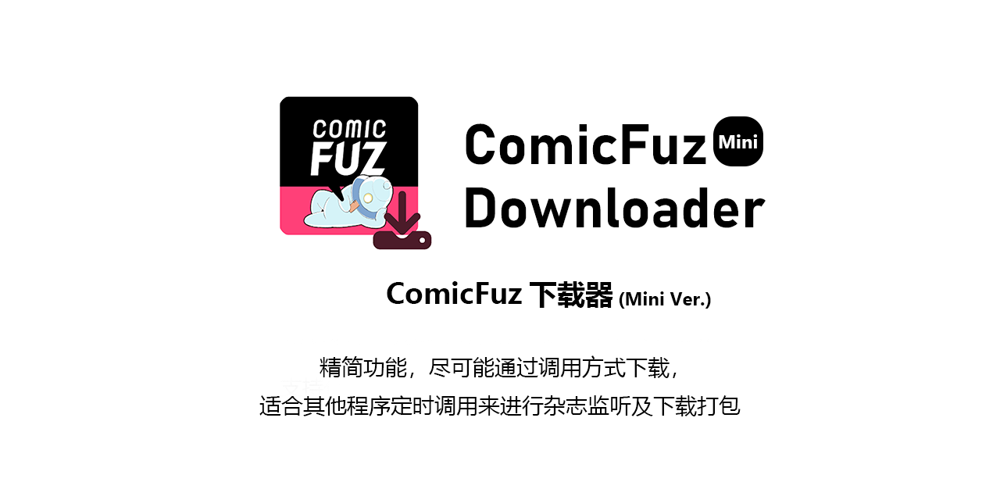

## 简介

[ComicFuz-Downloader](https://github.com/misaka10843/ComicFuz-Downloader)的Mini Ver，致力于能够第一时间获取杂志信息并且自动下载

## 支持功能

删除线部分均为[Full Ver](https://github.com/misaka10843/ComicFuz-Downloader)所支持的

* ~~漫画/单行本/~~ 杂志多线程下载
* 使用代理
* 自定义线程数量
* 自定义下载文件夹
* 支持登录
* ~~支持自动压缩图片(可自定义压缩率)/~~ 生成压缩包
* 下载出错时等待5s后自动重试
* ~~**批量下载(详细请见命令示例)**~~

## Mini Ver与Full Ver的区别

Mini Ver尽可能精简功能，删除了书籍/单话下载

理论上Mini Ver只支持在登录状态下下载杂志

在ComicFuz-MagazineDownloader中添加了更多的功能，如直接通过NoneBot的http正向来发送群文件

添加半自动更新

## 如何使用

请闲打开[.env.sample](.env.sample)文件并且根据下方的表格进行填写

|      参数       |                  解释                   |    是否必填    |
|:-------------:|:-------------------------------------:|:----------:|
|  OUTPUT_DIR   |                 保存路径                  |     v      |
|     EMAIL     |                  邮箱                   |     v      |
|   PASSWORD    |                  密码                   |     v      |
|  TOKEN_FILE   |                保存凭证的文件                |     v      |
| PROXY_ADDRESS | 代理IP:端口 只支持http协议，填写时请**不要**带上http:// |   x 默认为空   |
|   COMPRESS    |                 是否压缩                  | x 默认为False |
| CHECK_UPDATE  |              是否开启半自动检测更新              | x 默认为False |

然后将`.env.sample`更名成`.env`即可，如果您是使用的编译完成的exe等

请直接参考[.env.sample](.env.sample)中的内容以及上方的表格在程序更目录下创建`.env`进行填写